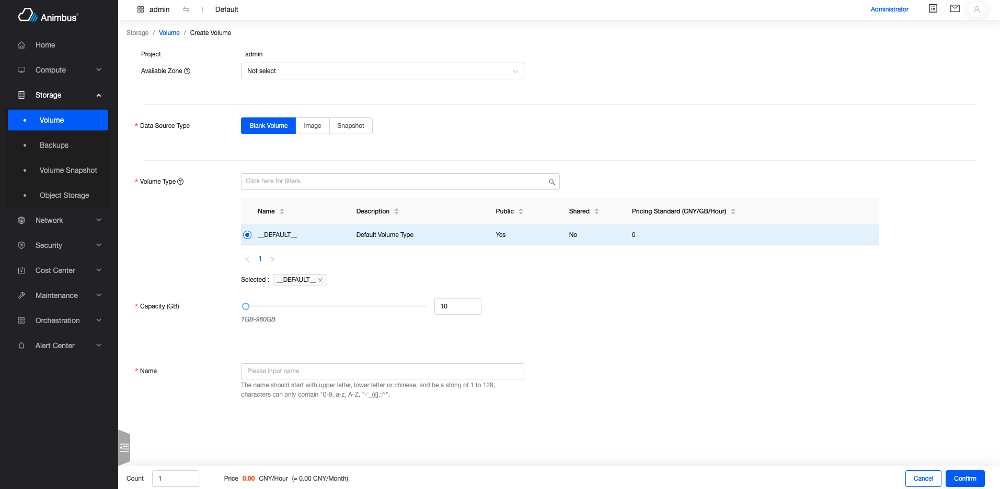
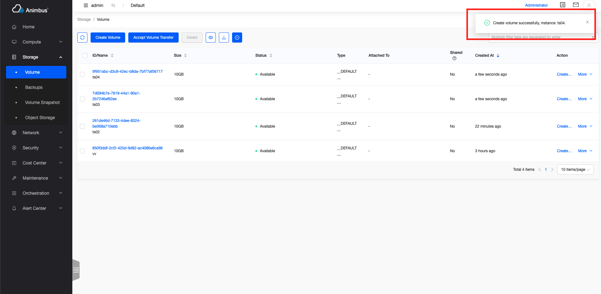

English | [Chinese](../../zh/develop/3-6-FormAction-introduction.md)

# Application



- After the operation button is clicked, a single page displays the Form form
- There is an independent route for access
- Generally used to create resources, or form with more form content
- After clicking the `Confirm` button, the status of `loading` will be displayed according to the sending status of the request. After the request is successful, it will automatically jump to the corresponding resource list page
- After clicking the `Cancel` button, it will automatically jump to the corresponding resource list page
- If the request is sent successfully, a message indicating that the operation was successful will be displayed in the upper right corner, and the message will automatically disappear after a few seconds

  

- If the request fails, an error message will be displayed in the upper right corner of the form page, which can only disappear after clicking the close button

# FormAction Code file

- `src/containers/Action/FormAction/index.jsx`

# FormAction Introduction to attribute and function definitions

- Single page forms are inherited from FormAction component
- Code location:`pages/xxxx/containers/XXXX/actions/xxx.jsx`
- Only need to copy some functions to complete the development of the page
- Attributes and functions are divided into the following four types,
  - The attributes and functions that must be replicated include:
    - Operation ID
    - Operation Title
    - The path corresponding to the page
    - The path corresponding to the resource list page
    - Operation corresponding permissions
    - Judgment on whether to disable the operation
    - Configuration of form items
    - Function to send request
  - Functions and attributes for on-demand overridden, mainly include:
    - The default value is of the form
  - Functions and attributes that do not need to be overridden, mainly include:
    - Whether the current page is a management platform page
  - The basic functions in the base class mainly include:
    - Render the page
    - Display of request status
    - Display of request results
  - See below for a more detailed and comprehensive introduction

## Properties and functions that must be overridden

- `id`
  - Static properties
  - ID of resource operation
  - Need to be unique, only for all operations in the `actions` of the resource to be unique
  - This attribute must be overridden
  - Take the volume creating `src/pages/storage/containers/Volume/actions/Create/index.jsx` as an example

    ```javascript
    static id = 'volume-create';
    ```

- `title`
  - Static properties
  - Title of resource operation
  - Take the volume creating `src/pages/storage/containers/Volume/actions/Create/index.jsx` as an example

    ```javascript
    static title = t('Create Volume');
    ```

- `path`
  - Corresponding routing for resource operations
  - Static properties or static functions
  - In the case of a static function, the parameters are
    - Parameter `item`, item data in the resource list
    - Parameter `containerProps`, the `props` property of the parent container (that is, the resource list page where the button is located)
    - Take the image creating `src/pages/compute/containers/Image/actions/Create.jsx` as an example
      - The path to the management platform is `/compute/image-admin/create`
      - The path to the console is `/compute/image/create`

      ```javascript
      static path = (_, containerProp) => {
        const { isAdminPage } = containerProp;
        return isAdminPage
          ? '/compute/image-admin/create'
          : '/compute/image/create';
      };
      ```

  - Static properties，Take the volume creating `src/pages/storage/containers/Volume/actions/Create/index.jsx` as an example

    ```javascript
    static path = '/storage/volume/create';
    ```

- `policy`
  - Static properties (Fill in the policy that complies with the openstack rules here)
  - The permission corresponding to the page. If the permission verification fails, the operation button will not be displayed on the resource list page
  - Take the volume `src/pages/storage/containers/Volume/actions/Create/index.jsx` as an example

    ```javascript
    static policy = 'volume:create';
    ```

- `aliasPolicy`
  - Static properties (Fill in the custom policy with module prefix here)
  - The permission corresponding to the page. If the permission verification fails, the operation button will not be displayed on the resource list page
  - Take the volume `src/pages/storage/containers/Volume/actions/Create/index.jsx` as an example

    ```javascript
    static aliasPolicy = 'cinder:volume:create';
    ```

- `allowed`
  - Static functions
  - Determine whether the operation needs to be disabled
  - Return `Promise`
  - Write directly without using disabled buttons

    ```javascript
    static allowed() {
      return Promise.resolve(true);
    }
    ```

  - The parameter `item`, the item data in the resource list, is generally used to determine the operation of the item in the resource list
  - The parameter `containerProps`, the `props` property of the parent container (that is, the resource list page where the button is located), is generally used to determine the operation of related resources under the details page
  - Take user creating `src/pages/identity/containers/User/actions/Create.jsx` as an example
    - If it is a user list in the domain details, the create user button will not be displayed

    ```javascript
    static allowed(item, containerProps) {
      const {
        match: { path },
      } = containerProps;
      if (path.indexOf('domain-admin/detail') >= 0) {
        return Promise.resolve(false);
      }
      return Promise.resolve(true);
    }
    ```

- `name`
  - The name of the operation
  - Use the name in the prompt after the request
  - Take the volume `src/pages/storage/containers/Volume/actions/Create/index.jsx` as an example

    ```javascript
    get name() {
      return t('create volume');
    }
    ```

- `listUrl`
  - Resource list page corresponding to this operation
  - After the operation request is successful, it will automatically enter the resource list page
  - Take the volume `src/pages/storage/containers/Volume/actions/Create/index.jsx` as an example

    ```javascript
    get listUrl() {
      return this.getRoutePath('volume');
    }
    ```

- `formItems`
  - The form item configuration list corresponding to the operation form
  - For the configuration information of each form item, please refer to [3-10-FormItem Introduction](3-10-FormItem-introduction.md)
  - Take the domain creating `src/pages/identity/containers/Domain/actions/Create.jsx` as an example
    - The form contains name, description, status

    ```javascript
    get formItems() {
      return [
        {
          name: 'name',
          label: t('Name'),
          type: 'input',
          placeholder: t('Please input name'),
          required: true,
          help: t('The name cannot be modified after creation'),
        },
        {
          name: 'description',
          label: t('Description'),
          type: 'textarea',
        },
        {
          name: 'enabled',
          label: t('Status'),
          type: 'radio',
          optionType: 'default',
          options: statusTypes,
          required: true,
          isWrappedValue: true,
          help: t(
            'Forbidden the domain will have a negative impact, all project and user in domain will be forbidden'
          ),
        },
      ];
    }
    ```

- `onSubmit`
  - The request function of the operation
  - After the operation request is successful, it will automatically enter the resource list page
  - After the operation fails, an error message will be displayed on the form page
  - Return `Promise`
  - Returns the function in the `store` corresponding to the form
  - Take the domain creating `src/pages/identity/containers/Domain/actions/Create.jsx` as an example

    ```javascript
    onSubmit = (values) => {
      values.enabled = values.enabled.value;
      return this.store.create(values);
    };
    ```

## Properties and functions for on-demand overridden

- `init`
  - Initial operation
  - Define `this.store` in it, the display of `loading` status is based on `this.store.isSubmitting`
  - Call the function to obtain other data required by the form in it
  - Update to the attributes in `this.state`
  - Take the volume creating `src/pages/storage/containers/Volume/actions/Create/index.jsx` as an example
    - Obtain quota information, available domain data, mirrored data, cloud disk type
    - Update the initial value in `this.state`

    ```javascript
    init() {
      this.snapshotStore = globalSnapshotStore;
      this.imageStore = globalImageStore;
      this.volumeStore = globalVolumeStore;
      this.volumeTypeStore = globalVolumeTypeStore;
      this.backupstore = globalBackupStore;
      this.getQuota();
      this.getAvailZones();
      this.getImages();
      this.getVolumeTypes();
      this.state = {
        ...this.state,
        count: 1,
        sharedDisabled: false,
      };
    }
    ```

- `defaultValue`
  - The initial value of the form
  - The default value is `{}`
  - Take the volume creating `src/pages/storage/containers/Volume/actions/Create/index.jsx` as an example
    - Set the default source, size, project, available domain, and volume type of the form

    ```javascript
    get defaultValue() {
      const size = this.quotaIsLimit && this.maxSize < 10 ? this.maxSize : 10;
      const { initVolumeType } = this.state;
      const values = {
        source: this.sourceTypes[0],
        size,
        project: this.currentProjectName,
        availableZone: (this.availableZones[0] || []).value,
        volume_type: initVolumeType,
      };
      return values;
    }
    ```

- `nameForStateUpdate`
  - When the content of the form item changes, update to the form key-value pair in `this.state`
  - These key-value pairs stored in `this.store` often affect the display of form items and need to be used in conjunction with the code in `get formItems`
    - Such as expand and hide more configuration items
    - Such as the mandatory changes of some form items
  - By default, changes to the form items of `radio`, `more` type are saved to `this.state`
  - Take the volume creating `src/pages/storage/containers/Volume/actions/Create/index.jsx` as an example
    - When `source=image`, display the image selection list, and set the minimum volume capacity based on the image selection
    - When `source=snapshot`, display the cloud disk snapshot list, and set the minimum value of the volume capacity based on the image selection

    ```javascript
    get nameForStateUpdate() {
      return ['source', 'image', 'snapshot'];
    }
    ```

- `renderFooterLeft`
  - Rendering of the inner left at the bottom of the form
  - The default value is `null`
  - Take the volume creating `src/pages/storage/containers/Volume/actions/Create/index.jsx` as an example
    - Show the number of batches created
    - Determine whether the current form is correct based on the entered quantity and remaining quota

    ```javascript
    const { count = 1 } = this.state;
    const configs = {
      min: 1,
      max: 100,
      precision: 0,
      onChange: this.onCountChange,
      formatter: (value) => `$ ${value}`.replace(/\D/g, ''),
    };
    return (
      <div>
        <span>{t('Count')}</span>
        <InputNumber
          {...configs}
          value={count}
          className={classnames(styles.input, 'volume-count')}
        />
        {this.renderBadge()}
      </div>
    );
    ```

- `errorText`
  - Display of error messages
  - Generally do not need to overridden
  - Take the volume creating `src/pages/storage/containers/Volume/actions/Create/index.jsx` as an example
    - Displays the error message that the quota verification fails. When the quota verification fails, the request is not sent, but the error message is displayed directly

    ```javascript
    get errorText() {
      const { status } = this.state;
      if (status === 'error') {
        return t(
          'Unable to create volume: insufficient quota to create resources.'
        );
      }
      return super.errorText;
    }
    ```

- `instanceName`
  - After the request is sent, the resource name in the prompt message
  - The default value is `this.values.name`
  - Take the volume creating `src/pages/storage/containers/Volume/actions/Create/index.jsx` as an example
    - If you are creating cloud disks in batches, display the names in the form of `${name}-${index + 1}`

    ```javascript
    get instanceName() {
      const { name } = this.values || {};
      const { count = 1 } = this.state;
      if (count === 1) {
        return name;
      }
      return new Array(count)
        .fill(count)
        .map((_, index) => `${name}-${index + 1}`)
        .join(', ');
    }
    ```

- `labelCol`
  - Configure the layout of the labels on the left side of the form
  - The default value is 

    ```javascript
    get labelCol() {
      return {
        xs: { span: 5 },
        sm: { span: 3 },
      };
    }
    ```

  - Take the image creating `src/pages/compute/containers/Image/actions/Create.jsx` as an example

    ```javascript
    get labelCol() {
      return {
        xs: { span: 6 },
        sm: { span: 5 },
      };
    }
    ```

- `wrapperCol`
  - Configure the layout of the content on the right side of the form
  - The default value is 

    ```javascript
    get wrapperCol() {
      return {
        xs: { span: 10 },
        sm: { span: 8 },
      };
    }
    ```

## Properties and functions that do not need to be overridden

- `values`
  - After the form is successfully validated, the updated form value
- `isAdminPage`
  - Is the current page a "management platform" page
- `getRoutePath`
  - Function to generate page URL
  - For example, it is necessary to provide a jump function to the associated resource. Using this function, you can jump to the corresponding address of the console in the console, and jump to the corresponding address of the management platform in the management platform.

## Basic functions in the base class

- `FormAction` inherits from `BaseForm`
- It is recommended to check the code understanding,`src/components/Form/index.jsx`
