English | [简体中文](../../zh/test/3-2-E2E-table-operation.md)

Because of the consistent use of the front-end framework, when we write related use cases for form operations, select elements and perform operations, we often find that there is a strong regularity, so we have written corresponding Cypress functions for most table operations. It greatly reduces the difficulty of writing test cases. The following will give a detailed description of the main table operation functions.

## Operations on the table

Mainly include: waiting for the list to load

- `waitTableLoading`

  - Wait for the list to load
  - During the loading process of the list, there will be a state of `loading`, wait for the end of the state

  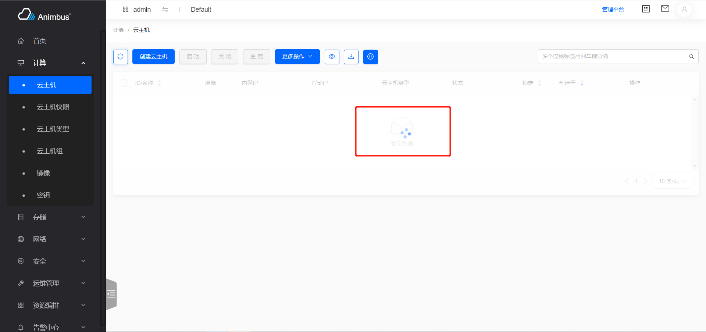

- `checkTableFirstRow`

  - Verify that the first row of the form contains the specified content, generally used to verify the existence of the created resource after creation
  - The parameter `name`, the content that needs to be included in the first line, is generally used to verify the existence of the name
  - Take viewing key pair detail `test/e2e/integration/pages/compute/keypair.spec.js` as an example

    - After creation, check whether the key exists, and enter the details page after successful verification

    ```javascript
    it('successfully detail', () => {
      cy.tableSearchText(name)
        .checkTableFirstRow(name)
        .goToDetail()
        .checkDetailName(name);
      cy.goBackToList(listUrl);
    });
    ```

    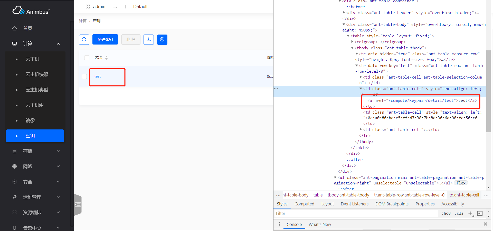

- `tableSearchText`

  - Typing in the search bar above the table, and wait for the search to complete
  - The parameter `str`, the search content, generally the search name
  - By searching, the resource to be operated is located in the first row of the table for subsequent operations
  - Take viewing key pair detail `test/e2e/integration/pages/compute/keypair.spec.js` as an example

    1. After creation, use the name to search for the key and wait for the search to complete
    2. Check if the first row in the table contains the resource with the specified name
    3. Go to the detail page and check if the name is consistent with expectations
    4. Return list page

    ```javascript
    it('successfully detail', () => {
      cy.tableSearchText(name)
        .checkTableFirstRow(name)
        .goToDetail()
        .checkDetailName(name);
      cy.goBackToList(listUrl);
    });
    ```

    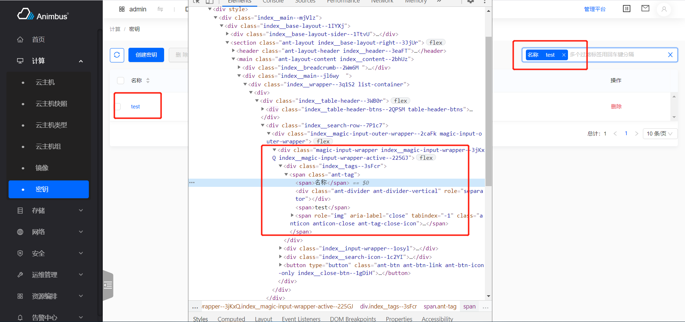

- `tableSimpleSearchText`

  - Type in the search bar above the form and wait for the search to complete
  - Some tables use simple search, and the search item only supports text input. At this time, the components used in the search box are different from the search box components in `tableSearchText`
  - The parameter `str`, the search content, generally the search name
  - By searching, the resource to be operated is located in the first row of the table for subsequent operations
  - Take instance `test/e2e/integration/pages/configuration/system.spec.js` in the search system information as an example

    ```javascript
    it('successfully services', () => {
      cy.tableSimpleSearchText('nova');
    });
    ```

    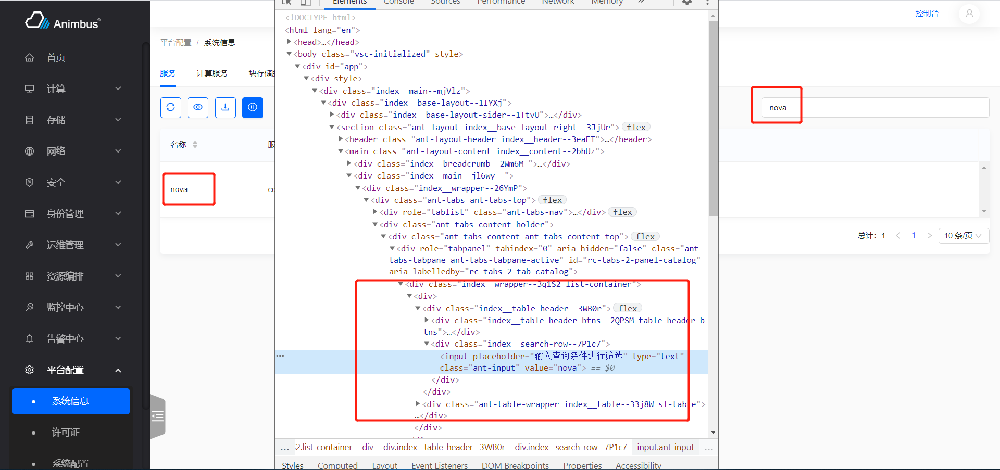

- `tableSearchSelect`

  - Use the options in the search bar above the table to search and wait for the search to complete
    1. Click the input box and select the search item from the search items to be selected
    2. Click to select the option under the search category
    3. Wait for the search to complete
  - Parameter `name`, the name of the search term
  - Parameter `value`, the label of the selected item corresponding to the search item
  - By searching, the resource to be operated is located in the first row of the table for subsequent operations
  - Take instance attach floating IP `test/e2e/integration/pages/network/floatingip.spec.js` as an example

    1. In the floating IP table, search for the floating IP whose `status` is `stop`
    2. Click the `associate` operation on the first resource in the table
    3. Complete the operation of attach instance

    ```javascript
    it('successfully associate instance', () => {
      cy.tableSearchSelect('Status', 'Down')
        .clickActionInMore('Associate')
        .wait(5000)
        .formTableSelectBySearch('instance', instanceName)
        .wait(5000)
        .formTableSelect('port')
        .clickModalActionSubmitButton();
    });
    ```

    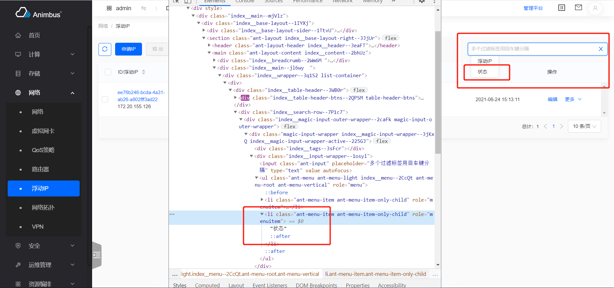

    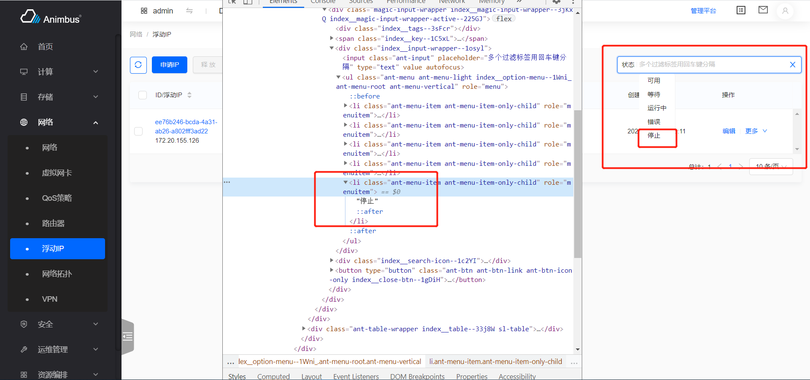

    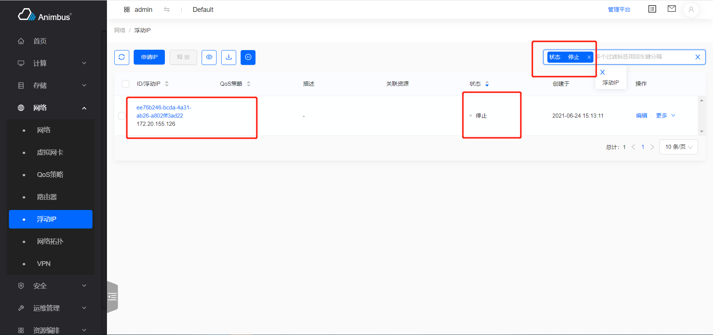

- `tableSearchSelectText`

  - Use the search bar above the table to search and wait for the search to complete
    1.  Click the input box and select the search item from the search items to be selected
    2.  Enter the search content and press Enter
    3.  Wait for the search to complete
  - Enter directly when you don’t select the search item, it is the first search item that supports input
  - Parameter `name`, the name of the search term
  - Parameter `value`, the content of the input
  - By searching, the resource to be operated is located in the first row of the table for subsequent operations
  - Take the creation of the stack as an example: `test/e2e/integration/pages/heat/stack.spec.js`
    1.  After creation, enter the resource list page
    2.  Search by name on the list page
    3.  Wait for the status of the resource to be available

  ```javascript
  it('successfully create', () => {
    const volumeJson = {
      name: volumeName,
    };
    cy.clickHeaderButton(1, 2000)
      .formAttachFile('content', contentFile)
      .formAttachFile('params', paramFile)
      .clickStepActionNextButton()
      .wait(2000)
      .formInput('name', name)
      .formJsonInput('volume_name_spec', volumeJson)
      .clickStepActionNextButton()
      .waitFormLoading()
      .wait(5000)
      .tableSearchSelectText('Name', name)
      .waitStatusActiveByRefresh();
  });
  ```

  

  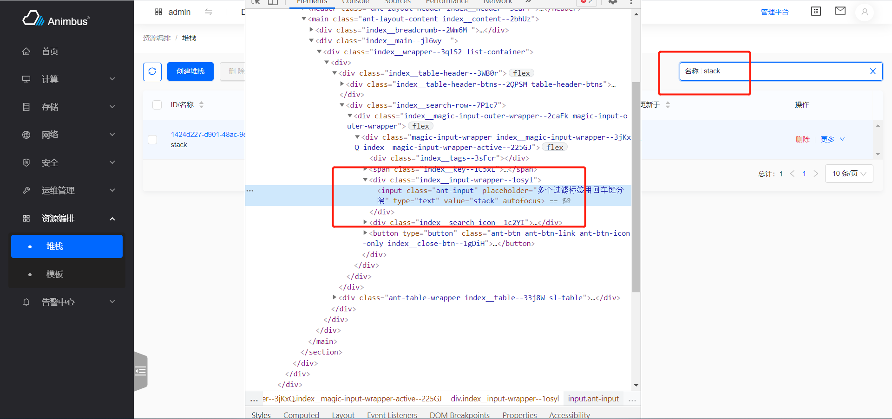

  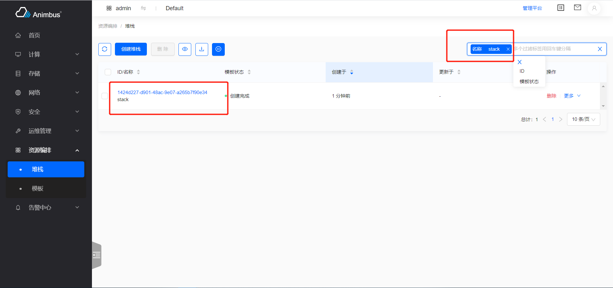

- `checkEmptyTable`
- Verify that the form is empty

  - Generally used to verify after deleting resources
  - Take deleting the router `test/e2e/integration/pages/network/router.spec.js` as an example
    1.  Turn off the external gateway
    2.  Delete
    3.  Search
    4.  Verify that the form is empty, that is, the deletion is successful

  ```javascript
  it('successfully close external gateway and delete', () => {
    cy.tableSearchText(newname)
      .clickConfirmActionInMore('Close External Gateway')
      .clickConfirmActionInMore('Delete')
      .tableSearchText(newname)
      .checkEmptyTable();
  });
  ```

- `goToDetail`
- Visit the detail page of the first row of resources and wait for the detail page to load

  - Parameter `index`, the subscript of the column where the link is located, the default is `1`
  - Parameter `waitTime`, the time to wait after loading the details page
  - Take the image as an example: `test/e2e/integration/pages/compute/image.spec.js`
    1.  Search
    2.  Enter the details page
    3.  Verification details name
    4.  Return to the list page

  ```javascript
  it('successfully detail', () => {
    cy.tableSearchText(name).goToDetail();
    cy.checkDetailName(name);
    cy.goBackToList(listUrl);
  });
  ```

  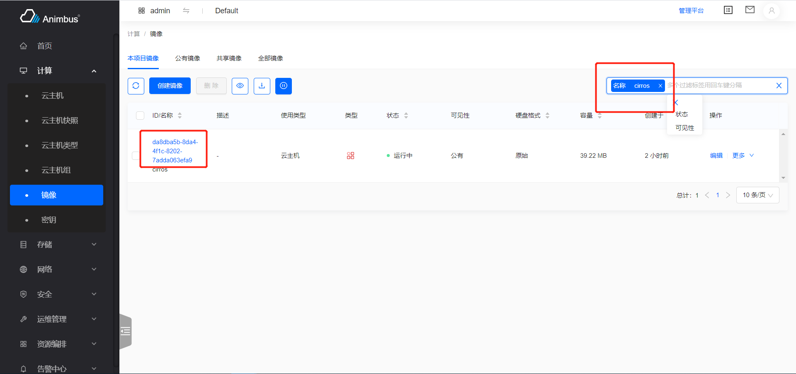

  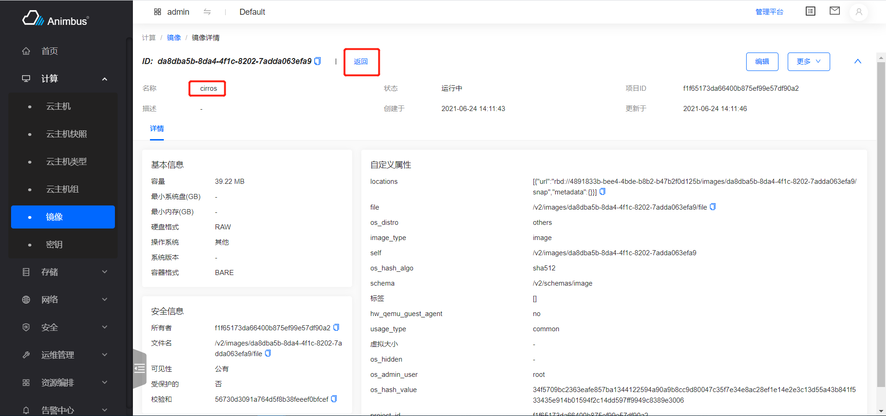

- `checkColumnValue`

  - Verify that the content of the specified column in the first row meets expectations
  - Parameter `columnIndex`, which specifies the index of the column
  - Parameter `value`, the expected value
  - Take the instance as an example: `test/e2e/integration/pages/compute/image.spec.js`

    1.  Search
    2.  Stop the instance
    3.  Verify that the status of the instance is `Stop`
    4.  Verify that the `stop` operation in the batch operation is unavailable

    ```javascript
    it('successfully stop', () => {
      cy.tableSearchText(name)
        .clickConfirmActionInMoreSub('Stop', 'Instance Status')
        .wait(10000)
        .tableSearchText(name)
        .checkColumnValue(6, 'Shutoff')
        .selectFirst()
        .clickHeaderButtonByTitle('Stop')
        .checkDisableAction(2000);
    });
    ```

    

- `selectFirst`

  - Select the first row in the table for subsequent batch operations
  - Take instance `test/e2e/integration/pages/compute/image.spec.js` as an example

    1. Search
    2. Stop the instance
    3. Verify that the status of the instance is `Stop`
    4. Select the first row
    5. Click the `Stop` button in the batch operation
    6. An error message pops up

    ```javascript
    it('successfully stop', () => {
      cy.tableSearchText(name)
        .clickConfirmActionInMoreSub('Stop', 'Instance Status')
        .wait(10000)
        .tableSearchText(name)
        .checkColumnValue(6, 'Shutoff')
        .selectFirst()
        .clickHeaderButtonByTitle('Stop')
        .checkDisableAction(2000);
    });
    ```

    

- `selectAll`

  - Check all the entries in the table, in order to do the follow-up batch operations
  - Usually used to clear data

  - `waitStatusActiveByRefresh`

    - Click the refresh button above the table every 5 seconds until the resource status becomes available
    - After a resource is created or changed, it often takes a certain amount of time to become available before subsequent operations can be performed
    - Take the creation of the stack as an example: `test/e2e/integration/pages/heat/stack.spec.js`

    ```javascript
    it('successfully create', () => {
      const volumeJson = {
        name: volumeName,
      };
      cy.clickHeaderButton(1, 2000)
        .formAttachFile('content', contentFile)
        .formAttachFile('params', paramFile)
        .clickStepActionNextButton()
        .wait(2000)
        .formInput('name', name)
        .formJsonInput('volume_name_spec', volumeJson)
        .clickStepActionNextButton()
        .waitFormLoading()
        .wait(5000)
        .tableSearchSelectText('Name', name)
        .waitStatusActiveByRefresh();
    });
    ```

    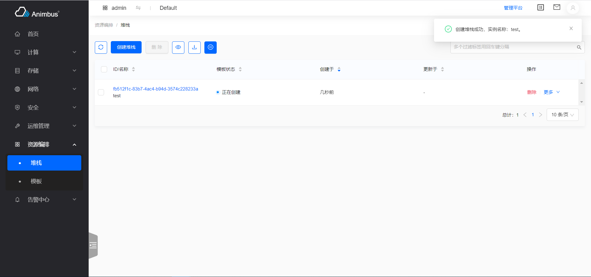

    

## Operation of the button

Mainly contains

- The main button operation (general is creation operation) and batch operation located at the top of the form
- Line operations on each line of the form

### Operation of the buttons above the form

The buttons above the table generally include: refresh, create, batch operation button, configure table list items, download

- `clickHeaderButton`

  - Click the button above the table,
  - Parameter `buttonIndex`, the subscript of the button above the table
  - Parameter `waitTime`, the waiting time after clicking, the default is 2 seconds
  - Generally, the subscript of the created button is 1
  - Take the create key pair as an example: `test/e2e/integration/pages/compute/keypair.spec.js`

  ```javascript
  it('successfully create', () => {
    cy.clickHeaderButton(1)
      .formInput('name', name)
      .clickModalActionSubmitButton()
      .wait(5000);
  });
  ```

  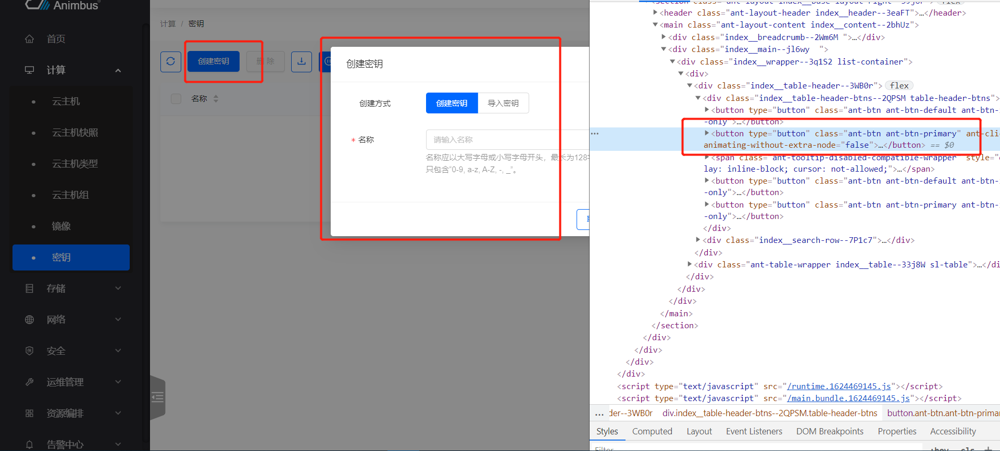

- `clickHeaderButtonByTitle`

  - Click the button above the table by name, generally used for batch operation button clicks

    - Parameter `title`, the text on the button above the table
    - Parameter `waitTime`, the waiting time after clicking, the default is 2 seconds
    - Take the shut off operation of the instance in the close state as an example: `test/e2e/integration/pages/compute/instance.spec.js`
      - Click the close button at the top of the form

    ```javascript
    it('successfully stop', () => {
      cy.tableSearchText(name)
        .clickConfirmActionInMoreSub('Stop', 'Instance Status')
        .wait(10000)
        .tableSearchText(name)
        .checkColumnValue(6, 'Shutoff')
        .selectFirst()
        .clickHeaderButtonByTitle('Stop')
        .checkDisableAction(2000);
    });
    ```

    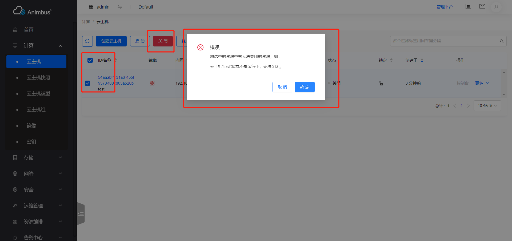

- `clickHeaderConfirmButtonByTitle`

  - The function will complete

    1. Click the button at the top of the table by name, the page will pop up a prompt to confirm the operation
    2. Click the `Confirm` button

    - Parameter `title`, the text on the button above the table
    - Parameter `waitTime`, the waiting time after clicking, the default is 2 seconds
    - Take the release of floating IP as an example: `test/e2e/integration/pages/network/floatingip.spec.js`
      - Select all floating IPs in the stopped state and release them in batches

    ```javascript
    it('successfully delete', () => {
      cy.tableSearchSelect('Status', 'Down')
        .selectAll()
        .clickHeaderConfirmButtonByTitle('Release');
    });
    ```

    

### Row operations on the first row of the form

- `clickFirstActionButton`

  - Click the first button in the operation column of the first row of the form, which is generally used for pop-up operation buttons
    Single-page operation button click
  - Take edit user `test/e2e/integration/pages/identity/user.spec.js` as an example

    ```javascript
    it('successfully edit', () => {
      cy.tableSearchText(name)
        .clickFirstActionButton()
        .formInput('name', newname)
        .clickModalActionSubmitButton();
    });
    ```

    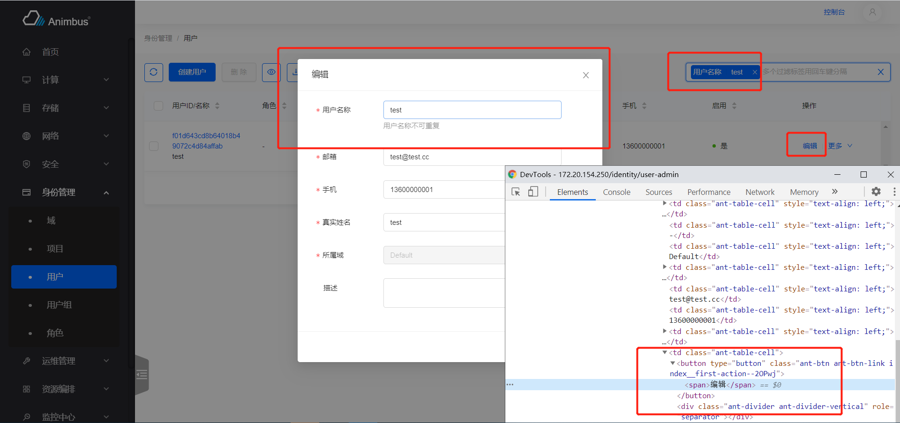

- `clickActionButtonByTitle`

  - Click the operation in the first row according to the title
  - Take edit and starting instance `test/e2e/integration/pages/configuration/system.spec.js` as an example

    - When instance starts, click the `Disable` button
    - When instance is stopped, click the `Enable` button

    ```javascript
    it('successfully disable compute services', () => {
      cy.clickTab(computeServicesTab)
        .tableSearchText('nova-compute')
        .clickActionButtonByTitle('Disable')
        .formText('disabled_reason', reason)
        .clickModalActionSubmitButton();
    });

    it('successfully enable compute services', () => {
      cy.clickTab(computeServicesTab)
        .tableSearchSelect('Service Status', 'Disabled')
        .clickActionButtonByTitle('Enable')
        .clickConfirmActionSubmitButton();
    });
    ```

    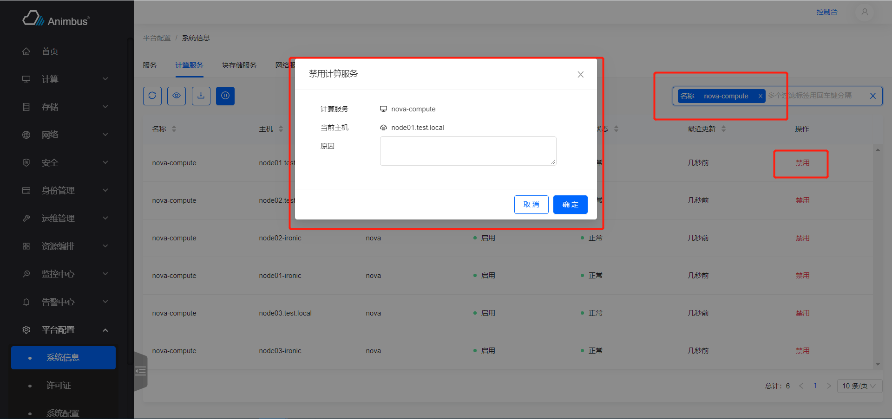

    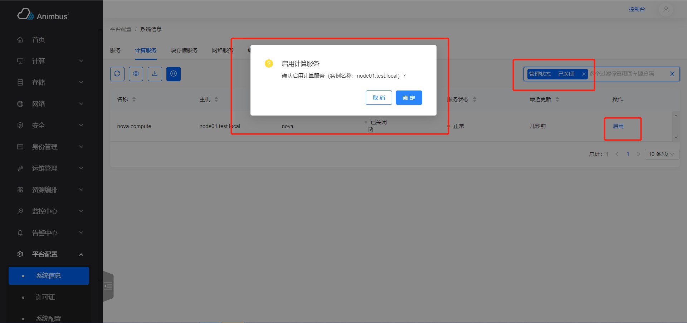

- `clickActionInMore`

  - Click the operation in `More` in the first row according to the title
  - Take the create instance button as an example: `test/e2e/integration/pages/compute/image.spec.js`

    ```javascript
    it('successfully create instance with cancel', () => {
      cy.tableSearchText(name)
        .clickActionInMore('Create Instance')
        .wait(2000)
        .clickStepActionCancelButton();
    });
    ```

    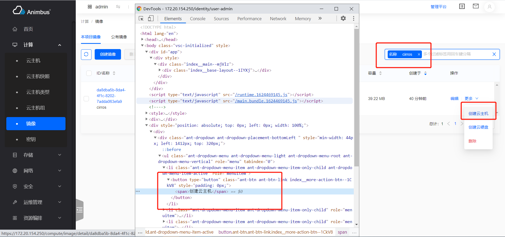

- `clickActionInMoreSub`

  - Click the operation under the submenu of the first row of operations according to the title
  - Parameter `title`, the title of the button
  - Parameter `subMenu`, the title of the submenu
  - Take the instance and click on the `Attach Interface` `test/e2e/integration/pages/compute/image.spec.js` under `Associated Resources` as an example

  ```javascript
  it('successfully attach interface', () => {
    cy.tableSearchText(name)
      .clickActionInMoreSub('Attach Interface', 'Related Resources')
      .wait(5000)
      .formTableSelect('network')
      .clickModalActionSubmitButton();
  });
  ```

  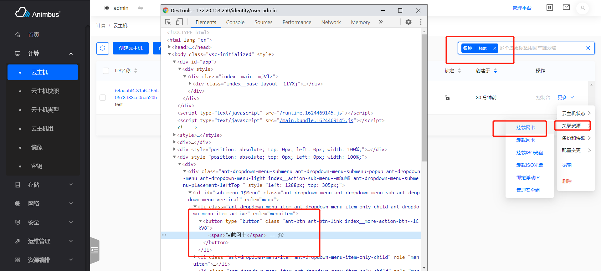

- `checkActionDisabledInFirstRow`

  - Verify that the specified operation of the resource with the specified name is not available
    1.  Search for resources based on specified names
    2.  Verify that the specified operation does not exist in the operation column `More` in the first row of the search result
  - Parameter `title`, the name of the operation
  - Parameter `name`, the name of the resource
  - After the resource is in certain states, some operations need to be disabled, the first operation in the row operation list, if it is not operable, it is in the `disabled` state, and the operations in `more`, if not available , Don’t show
  - Take the router as an example: `test/e2e/integration/pages/network/router.spec.js`
    1.  Open the public network gateway when creating the router
    2.  Verify that the router cannot be deleted, that is, there is no `Delete` button

  ```javascript
  it('successfully disable delete', () => {
    cy.checkActionDisabledInFirstRow('Delete', name);
  });
  ```

  

- `clickFirstActionDisabled`

  - Verify that the first operation in the first row of the table is unavailable
  - After the resource is in certain states, some operations need to be disabled, the first operation in the row operation list, if it is not operable, it is in the `disabled` state, and the operations in `more`, if not available , Don’t show
  - Take instance group `test/e2e/integration/pages/compute/server-group.spec.js` as an example

    1. Create a instance under the instance group
    2. Verify that the instance group containing instance cannot be deleted
    3. After deleting instance, the instance group is successfully deleted

    ```javascript
    it('successfully delete', () => {
      cy.clickFirstActionDisabled();
      cy.forceDeleteInstance(instanceName);
      cy.wait(5000);
      cy.visitPage(listUrl)
        .tableSearchText(name)
        .clickConfirmActionInFirst()
        .checkEmptyTable();
    });
    ```

    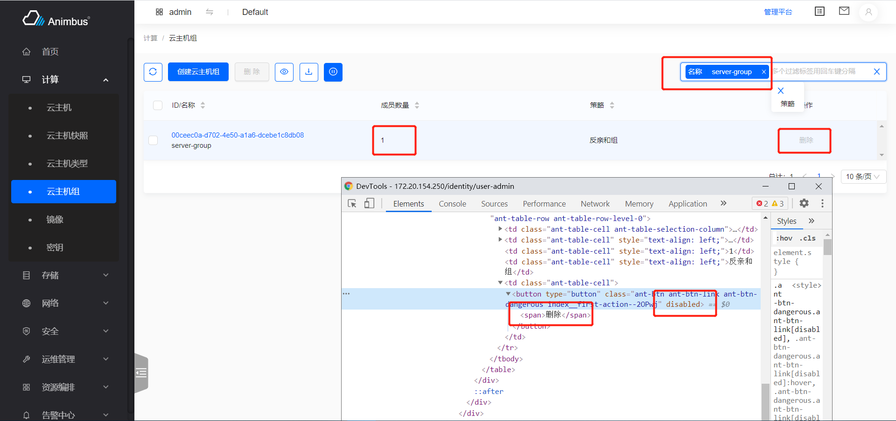

- `clickConfirmActionInFirst`

  - Complete the operation corresponding to the first operation button in the first row of the table
    1. Click the first operation button in the first row of the table. This operation is a confirmation operation
    2. Click the `Confirm` button, and wait for the request to complete, close the prompt message that the request is successful
  - Parameter `waitTime`, the waiting time after closing the operation successful prompt
  - Take instance group `test/e2e/integration/pages/compute/server-group.spec.js` as an example

    1. Create a instance under the instance group
    2. Verify that the instance group containing instance cannot be deleted
    3. After deleting the instance, the instance group is successfully deleted

    ```javascript
    it('successfully delete', () => {
      cy.clickFirstActionDisabled();
      cy.forceDeleteInstance(instanceName);
      cy.wait(5000);
      cy.visitPage(listUrl)
        .tableSearchText(name)
        .clickConfirmActionInFirst()
        .checkEmptyTable();
    });
    ```

    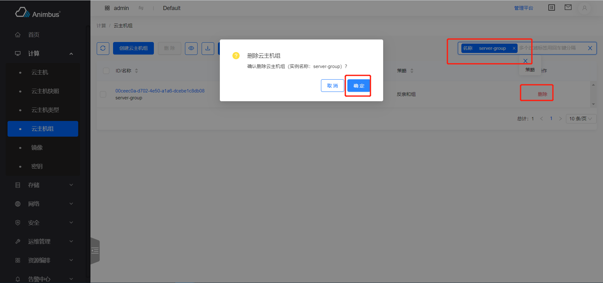

    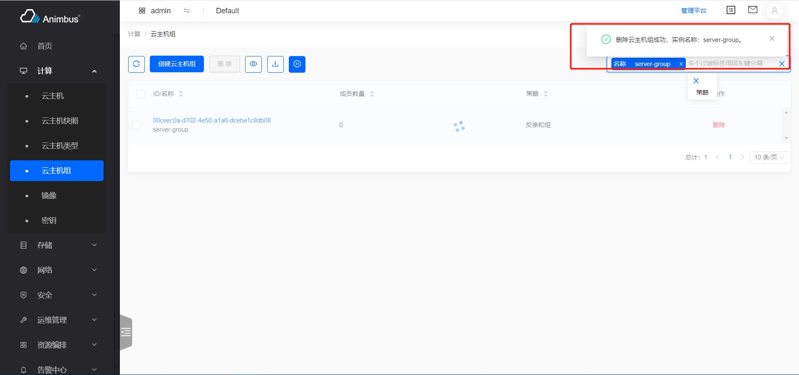

- `clickConfirmActionButton`

  - Complete the corresponding operation in the operation buttons listed in the first row of the table
    1. Click the specified operation in the first row of the table. This operation is a confirmation operation
    2. Click the `Confirm` button, and wait for the request to complete, close the prompt message that the request is successful
  - Parameter `title`, specify the name of the operation
  - Parameter `waitTime`, the waiting time after closing the operation prompt successfully
  - Take delete VPN IPsec policy `test/e2e/integration/pages/compute/server-group.spec.js` as an example

    ```javascript
    it('successfully delete ipsec policy', () => {
      cy.clickTab('IPsec Policy')
        .tableSearchText(ipsecPolicy)
        .clickConfirmActionButton('Delete');
    });
    ```

    

- `clickConfirmActionInMore`

  - Complete the corresponding operation in `More` in the first row of the table
    1. Click the specified operation in `More` in the first row of the table. This operation is a confirmation operation
    2. Click the `Confirm` button, and wait for the request to complete, close the prompt message that the request is successful
  - Parameter `title`, specify the name of the operation
  - Parameter `waitTime`, the waiting time after closing the operation prompt successfully
  - Take deleting the router `test/e2e/integration/pages/network/router.spec.js` as an example

    1. Search
    2. Complete the operation of `Close public gateway` in `More`
    3. Complete the `Delete` operation in `More`

    ```javascript
    it('successfully close external gateway and delete', () => {
      cy.tableSearchText(newname)
        .clickConfirmActionInMore('Close External Gateway')
        .clickConfirmActionInMore('Delete')
        .tableSearchText(newname)
        .checkEmptyTable();
    });
    ```

    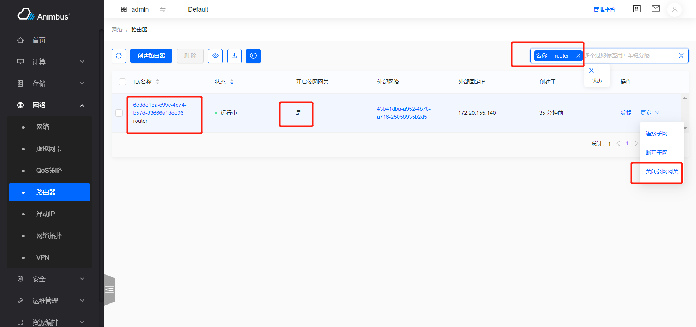

    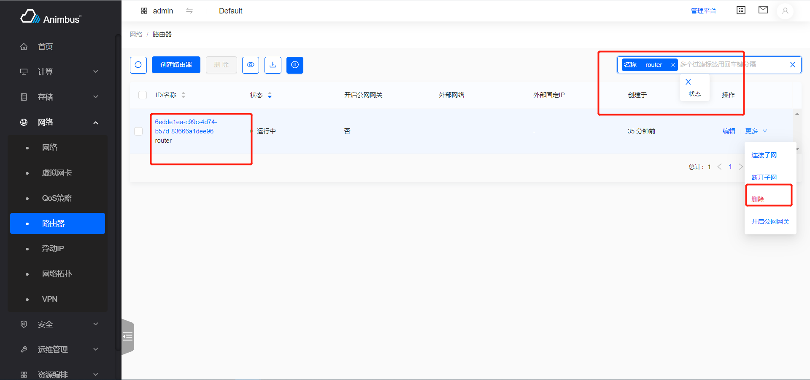

- `clickConfirmActionInMoreSub`

  - Complete the corresponding operation under the specified submenu in `More` in the first row of the table
    1. Click the specified operation under the specified submenu in `More` in the first row of the table. This operation is a confirmation operation
    2. Click the `Confirm` button, and wait for the request to complete, close the prompt message that the request is successful
  - Parameter `title`, specify the name of the operation
  - The parameter `subMenu`, specifies the name of the submenu
  - Parameter `waitTime`, the waiting time after closing the operation prompt successfully
  - Take lock the instance `test/e2e/integration/pages/compute/instance.spec.js` as an example

    ```javascript
    it('successfully lock', () => {
      cy.tableSearchText(name)
        .clickConfirmActionInMoreSub('Lock', 'Instance Status')
        .wait(10000);
      cy.tableSearchText(name)
        .selectFirst()
        .clickHeaderButtonByTitle('Start')
        .checkDisableAction(2000)
        .clickHeaderButtonByTitle('Stop')
        .checkDisableAction(2000)
        .clickHeaderButtonByTitle('Reboot')
        .checkDisableAction(2000);
    });
    ```

    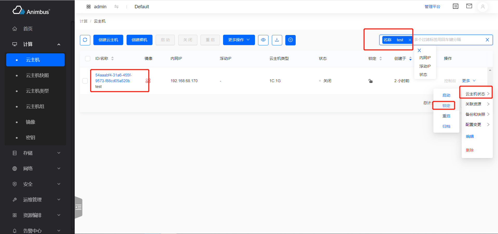

For the various operations of the table operation, the functions introduced above are mainly used. For the specific writing of the functions, please view `test/e2e/support/table-commands.js`
